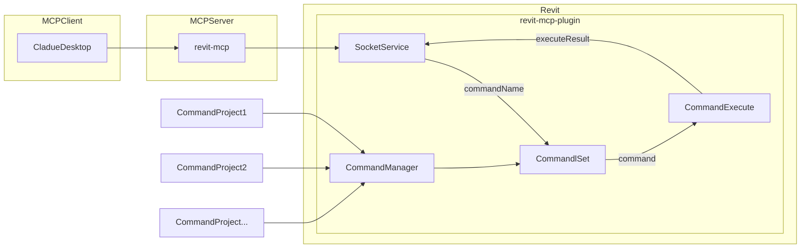

[](https://mseep.ai/app/revit-mcp-revit-mcp)

# Revit MCP Enhanced

An advanced Model Context Protocol (MCP) server for comprehensive Revit automation and drafting through natural language. Enhanced with 50+ powerful tools for BIM automation, documentation, and intelligent manipulation.

## Description

revit-mcp allows you to interact with Revit using the MCP protocol through MCP-supported clients (such as Claude Desktop, Cline, and other AI assistants).

This project is the **MCP server side** (providing Tools to AI). You need to use [revit-mcp-plugin](https://github.com/revit-mcp/revit-mcp-plugin) (the Revit plugin that drives Revit API) in conjunction.

## Key Features

- **Comprehensive Data Retrieval**: Get detailed information from Revit projects with intelligent filtering
- **Advanced Element Creation**: Create walls, floors, ceilings, rooms, and families with natural language
- **View & Sheet Management**: Automate view creation, duplication, and sheet organization  
- **Annotation Automation**: Batch tag elements, create dimensions, add text notes, and detail lines
- **Room & Space Planning**: Create and manage rooms with automatic area calculations
- **Grid & Reference Systems**: Create grids, reference planes, and level management
- **Visual Controls**: Color-code elements, set transparency, isolate, hide, and highlight
- **AI-Generated Code Execution**: Send custom code to Revit for complex operations

## Requirements

- nodejs 18+

> Complete installation environment still needs to consider the needs of revit-mcp-plugin, please refer to [revit-mcp-plugin](https://github.com/revit-mcp/revit-mcp-plugin)

## Installation

### 1. Build local MCP service

Install dependencies

```bash
npm install
```

Build

```bash
npm run build
```

### 2. Client configuration

**Claude client**

Claude client -> Settings > Developer > Edit Config > claude_desktop_config.json

```json
{
    "mcpServers": {
        "revit-mcp": {
            "command": "node",
            "args": ["<path to the built file>\\build\\index.js"]
        }
    }
}
```

Restart the Claude client. When you see the hammer icon, it means the connection to the MCP service is normal.


## Framework



## Supported Tools

### 📊 Data Retrieval & Querying
| Name                      | Description                               |
| ------------------------- | ----------------------------------------- |
| get_current_view_info     | Get current view info                     |
| get_current_view_elements | Get current view elements                 |
| get_available_family_types | Get available family types in current project |
| get_selected_elements      | Get selected elements                      |
| ai_element_filter         | Advanced intelligent filtering with spatial queries |
| get_views_list            | List all views with filtering options     |
| get_sheets_list           | List all sheets in the project            |
| get_grids_list            | List all grids with geometry data         |
| get_levels_list           | List all levels with elevations           |
| get_rooms_list            | List all rooms with area and properties   |

### 🏗️ Element Creation
| Name                      | Description                               |
| ------------------------- | ----------------------------------------- |
| create_point_based_element  | Create point based element (door, window, furniture) |
| create_line_based_element   | Create line based element (wall, beam, pipe) |
| create_surface_based_element   | Create surface based element (floor, ceiling) |

### 👁️ View Management
| Name                      | Description                               |
| ------------------------- | ----------------------------------------- |
| create_view               | Create floor plans, sections, elevations, 3D views |
| duplicate_view            | Duplicate views with detailing options    |
| set_view_properties       | Modify view scale, detail level, templates |
| set_view_range            | Configure view range (top, cut plane, bottom, underlay) |
| create_scope_box          | Create scope boxes for coordinated view cropping |

### 📄 Sheet & Viewport Management
| Name                      | Description                               |
| ------------------------- | ----------------------------------------- |
| create_sheet              | Create sheets with titleblocks            |
| place_viewport            | Place views on sheets as viewports        |

### 📐 Annotation Tools
| Name                      | Description                               |
| ------------------------- | ----------------------------------------- |
| create_dimension          | Create linear, angular, radial dimensions |
| create_tag                | Tag elements (doors, windows, rooms, etc.)|
| batch_tag_elements        | Auto-tag multiple elements efficiently    |
| create_text_note          | Create text annotations 
| create_callout            | Create detailed callout views with reference bubbles |
| create_elevation_marker   | Create elevation markers generating multiple views |
| create_keynote            | Add specification keynotes to elements    |
| create_section_marker     | Create building section views with markers |in views          |
| create_detail_lines       | Create 2D detail lines for drafting       |
| tag_walls		     | Tag all walls in view            |

### 📏 Grid & Reference Systems
| Name                      | Description                               |
| ------------------------- | ----------------------------------------- |
| create_grid               | Create linear and arc grid lines          |
| create_reference_plane    | Create reference planes for alignment     |

### 🏠 Room & Space Management
| Name                      | Description                               |
| ------------------------- | ----------------------------------------- |
| create_room               | Create rooms with automatic area calculation |
| cr📊 Schedules & Analysis Tools
| Name                      | Description                               |
| ------------------------- | ----------------------------------------- |
| create_schedule           | Create room, door, window, material schedules |
| apply_view_filter         | Apply parametric filters with graphic overrides |
| create_color_scheme       | Create color-coded plans by parameter values |

### 🎨 Detail Components
| Name                      | Description                               |
| ------------------------- | ----------------------------------------- |
| create_filled_region      | Create hatched/patterned regions for details |
| create_detail_component   | Place 2D detail symbols (bolts, welds, etc.) |
| create_masking_region     | Create opaque masks to hide drawing areas |

### 📝 Revision & Documentation
| Name                      | Description                               |
| ------------------------- | ----------------------------------------- |
| create_revision_cloud     | Create revision clouds to mark design changes |
| manage_revisions          | Create and manage project revision tracking |

### eate_room_separation_line | Define room boundaries with separation lines |
| update_room_properties    | Update room names, numbers, finishes      |
| store_room_data           | Store room data in local database         |

### ✏️ Element Modification & Operations
| Name                      | Description                               |
| ------------------------- | ----------------------------------------- |
| modify_element            | Modify element's properties (instance parameters) |
| operate_element           | Select, color, transparency, hide, isolate, delete |
| delete_elements           | Delete elements                            |
| color_splash		     | Color elements based on parameter value	|

### 🔧 Advanced Tools
| Name                      | Description                               |
| ------------------------- | ----------------------------------------- |
| send_code_to_revit        | Send code to Revit to execute             |
| search_modules            | Search for available modules              |
| use_module                | Use module                                |
| reset_model               | Reset model (delete process model when executing continuous dialog) |

### 💾 Data Persistence
| Name                      | Description                               |
| ------------------------- | ----------------------------------------- |
| store_project_data        | Store project metadata in local database  |
| query_stored_data         | Query stored project information          |
