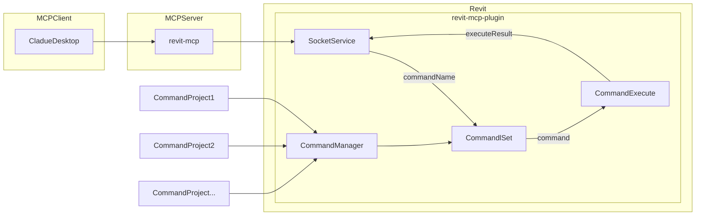
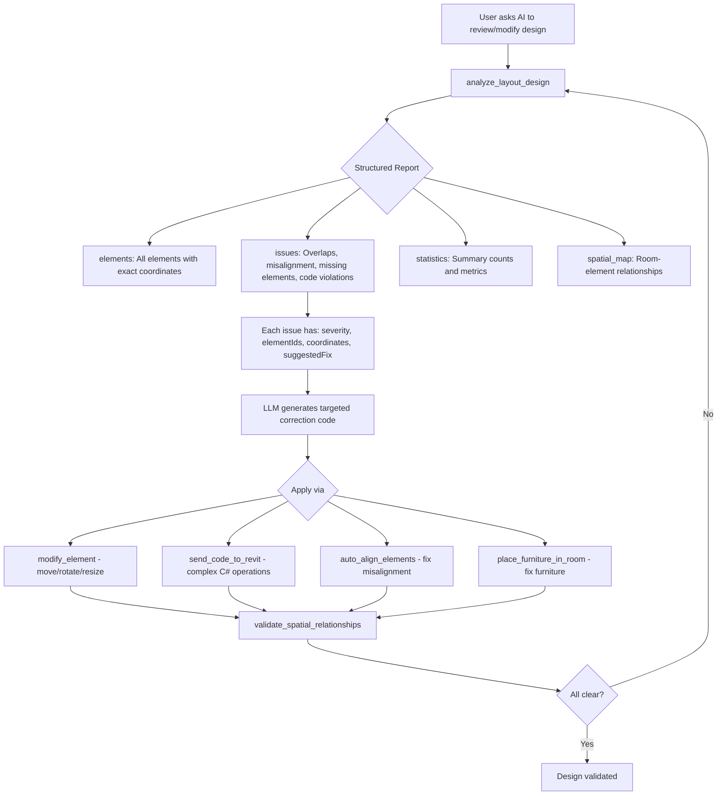
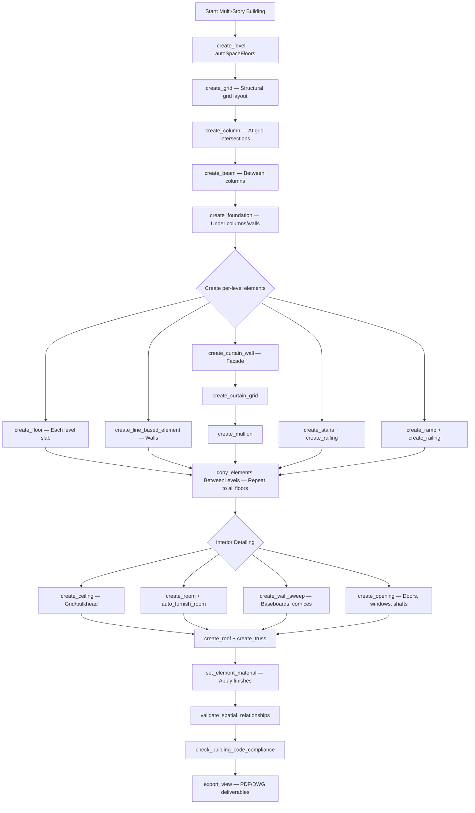

[](https://mseep.ai/app/revit-mcp-revit-mcp)

# Revit MCP Enhanced

An advanced Model Context Protocol (MCP) server for comprehensive Revit automation and drafting through natural language. Enhanced with **130+ powerful tools** for complete BIM automation: **Architectural** (structural systems, multi-story buildings, walls, floors, roofs, stairs, ramps, curtain walls), **MEP** (electrical circuits & panels, HVAC ducts & equipment, plumbing pipes & fixtures, fire sprinkler systems, load calculations, auto-routing), **Coordination** (clash detection, measurements, element relationships, phasing), **Geometry Operations** (copy, array, mirror, trim, split, offset), **Visualization** (3D views, assemblies), **Import/Export** (CAD, model linking, PDF/DWG export), **Materials & Parameters** (browse/assign materials, read/write parameters), **AI-Driven** (layout optimization, auto-furnishing, code compliance), and **Fabrication** (shop-ready MEP detailing with spool sheets).

## Description

revit-mcp allows you to interact with Revit using the MCP protocol through MCP-supported clients (such as Claude Desktop, Cline, and other AI assistants).

This project is the **MCP server side** (providing Tools to AI). You need to use [revit-mcp-plugin](https://github.com/revit-mcp/revit-mcp-plugin) (the Revit plugin that drives Revit API) in conjunction.

## Key Features

- **AI Design Analysis & Validation**: Deep model scanning that returns structured issue reports with exact coordinates, eliminating LLM hallucination and enabling precise correction code generation
- **Intelligent Furniture Automation**: Room-aware furniture placement, auto-furnishing by room type, furniture catalog browsing, and AI-driven layout optimization
- **Advanced Drafting Tools**: Auto-dimensioning (9 modes), drafting views, legend creation, annotation symbols with auto-numbering
- **Building Code Compliance**: Automated checks for egress, ADA/accessibility, fire safety, and spatial requirements (IBC, NBC India, Eurocode)
- **Layout Optimization**: AI-driven room layout optimization with 8 strategies (space efficiency, circulation, ergonomics, natural light, etc.)
- **Auto-Alignment**: Detect and correct misaligned walls, columns, doors, and furniture with configurable tolerance
- **Mirror & Copy Layouts**: Replicate furniture layouts between rooms, copy floor plans across levels
- **Comprehensive Data Retrieval**: Get detailed spatial/geometric data from Revit projects with intelligent filtering
- **Structural Systems**: Beams, trusses, braces, foundations (wall/isolated/strip/mat) — complete structural framework for multi-story buildings
- **Multi-Story Building**: Create levels with auto-spaced floors, copy elements between levels, array structural bays
- **Wall Creation**: Dedicated wall tool with stacked walls, embedded walls, location line control, and layer structure configuration
- **Drafting Automation**: Dedicated tools for floors (sloped, structural), ceilings (grid pattern, bulkhead), roofs (footprint, extrusion), curtain walls, curtain grids, mullions, stairs, ramps, railings, columns, and openings
- **Coordination & Analysis**: Element relationship analysis, distance measurement, clash detection (geometric collision detection between disciplines)
- **Phasing & Renovation**: Create phases (Existing, Demolition, New Construction), assign phase created/demolished to elements
- **Geometry Operations**: Copy, array (linear/radial/2D grid), mirror, split, trim/extend, offset, join/unjoin geometry, and group elements — the core drafting efficiency tools
- **Wall Detailing**: Edit wall profiles (parapets, stepped), wall sweeps (cornices, baseboards, crown molding), and wall reveals (groove lines)
- **Site Design**: Create topography surfaces, building pads, and site grading
- **Family & Component Management**: Load families from library, browse loaded families catalog by category, and place component instances with host element support
- **Parameters & Materials**: Read/write any element parameter, browse project materials, assign materials by parameter or paint
- **Area Planning**: Create area plans, area boundaries, and calculate rentable/gross areas per BOMA standards
- **3D Views & Visualization**: Create perspective and orthographic 3D views with camera control, preset orientations, section boxes, and display styles
- **Import & Linking**: Import CAD (DWG/DXF) for reference, link Revit models for coordination, manage linked model positioning
- **Assembly Views**: Create construction detail assemblies with auto-generated views for shop drawings and prefab coordination
- **Export & Documentation**: Export views to PNG, JPEG, PDF, DWG, DXF with configurable resolution, paper size, and layer mapping
- **Electrical Systems**: Circuits, panels, fixtures, conduit routing, NEC load calculations — complete power & lighting design
- **Mechanical (HVAC) Systems**: Ductwork, AHUs, VAVs, diffusers, system definition, ASHRAE load calculations — complete HVAC design
- **Plumbing Systems**: Pipes, fixtures, water/sanitary/storm systems, fixture unit calculations — complete plumbing design
- **Fire Protection**: Sprinkler systems with NFPA 13 compliance, auto head spacing, hazard classification
- **MEP Coordination**: Auto-routing with clash avoidance, MEP spaces, fabrication-ready detailing with spool sheets
- **Advanced Element Creation**: Create walls, floors, ceilings, roofs, rooms, columns, and families with natural language
- **Complete Element Modification**: Move, rotate, resize, change type, flip, mirror, pin/unpin, and set parameters
- **View & Sheet Management**: Automate view creation, duplication, and sheet organization
- **Annotation Automation**: Batch tag elements, create dimensions, add text notes, and detail lines
- **Room & Space Planning**: Create and manage rooms with automatic area calculations
- **Grid & Reference Systems**: Create grids, reference planes, model lines, and level management
- **Visual Controls**: Color-code elements, set transparency, isolate, hide, and highlight
- **Spatial Validation**: Check clearances, overlaps, adjacencies, and accessibility compliance
- **AI-Generated Code Execution**: Send custom code to Revit for complex operations

## Requirements

- nodejs 18+

> Complete installation environment still needs to consider the needs of revit-mcp-plugin, please refer to [revit-mcp-plugin](https://github.com/revit-mcp/revit-mcp-plugin)

## ⚡ Quick Setup (5 minutes)

### Automated Setup (Recommended)

**Windows:**
```bash
./quick-setup-secure.bat
```

**Linux/Mac:**
```bash
chmod +x quick-setup-secure.sh
./quick-setup-secure.sh
```

> This auto-generates your API key, creates certificates, and configures everything!

### What Gets Generated

After running setup, you'll have:
- ✅ **Random 64-char API Key** - Saved in `.env` file automatically
- ✅ **SSL Certificates** - For secure HTTPS connection
- ✅ **Configuration** - `.env` file with all settings

### Configure Claude Desktop

Edit your Claude config (`%APPDATA%\Claude\claude_desktop_config.json`):

```json
{
  "mcpServers": {
    "revit-mcp": {
      "url": "https://localhost:3000",
      "env": {
        "Authorization": "Bearer YOUR_API_KEY_HERE"
      }
    }
  }
}
```

Get your API key from the `.env` file created by setup script.

### Start Server

```bash
# Option 1: Direct
node server-secure.js

# Option 2: PM2 (Recommended)
npm install -g pm2
pm2 start ecosystem-secure.config.js
pm2 logs revit-mcp-secure
```

### Verify Connection

```bash
# Test health (no auth needed)
curl -k https://localhost:3000/health

# Test with API key
curl -k https://localhost:3000/status -H "X-API-Key: YOUR_KEY_FROM_.env"
```

---

## 🔐 Security Features

✅ **API Key Authentication** - All requests require valid API key  
✅ **HTTPS/TLS** - Encrypted communication  
✅ **IP Whitelist** - Optional, restrict by network  
✅ **Rate Limiting** - 100 requests/minute (configurable)  
✅ **Default Localhost** - Zero public exposure by default  

See `START_HERE.md` for more options.

## Framework



## Supported Tools (130+)

### 🧠 AI Design Analysis & Validation *(NEW)*

> These tools eliminate LLM hallucination by providing ground-truth model data. Always run `analyze_layout_design` before making design decisions.

| Name | Description |
| --- | --- |
| analyze_layout_design | **CRITICAL** - Deep comprehensive scan of the entire model. Returns structured issues (overlaps, misalignment, missing boundaries, code violations) with exact coordinates, element IDs, severity levels, and suggested fixes. The LLM uses the returned issue list to generate targeted correction code. Scans: structural elements, spatial relationships, furniture placement, annotations, and code compliance. |
| get_element_spatial_data | Retrieve precise spatial/geometric data for elements - bounding boxes, exact XYZ coordinates, dimensions, rotation, connected elements, room containment, facing direction, and host element info. Essential for accurate AI spatial reasoning. |
| validate_spatial_relationships | Check clearances (door swing zones, corridor widths, furniture spacing), detect overlaps, verify room adjacencies, and validate ADA/accessibility compliance with configurable thresholds. |
| check_building_code_compliance | Full building code compliance checking against IBC 2021, IBC 2018, NBC India, Eurocode, or BS UK. Checks egress (exit widths, travel distance), accessibility (ADA clearances, wheelchair turning), fire safety (rated walls, exit separation), and spatial minimums. Returns violations with code references and recommendations. |
| auto_align_elements | Detect and auto-correct misaligned walls, columns, doors, windows, furniture, grids, and annotations. Snaps elements to grid, makes near-parallel walls truly parallel, centers doors in walls. Configurable tolerance (default 10mm) with preview-before-apply mode. |

### 🪑 Furniture & Layout Automation *(NEW)*

| Name | Description |
| --- | --- |
| get_furniture_catalog | Browse all loaded furniture families and types with dimensions, categories, and type IDs. Searches across OST_Furniture, OST_FurnitureSystems, OST_SpecialityEquipment, OST_Casework, and OST_GenericModel. Filter by name, functional type (seating, tables, desks, storage, beds, sofas), and size range. |
| place_furniture_in_room | Room-aware intelligent furniture placement. Supports wall-relative positioning (against north/south/east/west wall), corner placement, center placement, and absolute coordinates. Auto-calculates rotation based on facing direction (wall, center, door, window). Validates room boundary containment and minimum clearances. |
| auto_furnish_room | Automatically furnish a room based on type and design standards. Supports: single/shared office, conference room, living room, bedroom, master bedroom, kitchen, dining room, bathroom, reception, lobby, classroom, library, and custom. Analyzes room geometry, door/window positions, and available area to generate optimal furniture layout with proper circulation paths. |
| optimize_room_layout | AI-driven layout optimization with 8 strategies: space efficiency, circulation, ergonomics, natural light, collaboration, privacy, symmetry, and balanced. Reads current room geometry and furniture, generates optimized positions, and optionally applies changes. Reports before/after metrics (utilization %, circulation score). |
| mirror_copy_layout | Mirror or copy layout patterns between rooms, levels, or regions. Mirror room furniture across an axis, copy furniture layout from one room to another, replicate entire floor layouts across levels, array-copy element groups. Intelligently adapts placement when destination has different dimensions. |

### 📐 Annotation & Drafting Tools *(EXPANDED)*

| Name | Description |
| --- | --- |
| create_dimension | Create linear, angular, and radial dimensions |
| batch_dimension_elements | **NEW** - Intelligent auto-dimensioning with 9 modes: wall lengths, wall-to-wall distances, door positions, window positions, grid spacing, room dimensions, element spacing, overall building dimensions, and custom reference pairs. Creates properly placed, non-overlapping dimension chains with automatic offset. |
| create_tag | Tag elements (doors, windows, rooms, etc.) |
| batch_tag_elements | Auto-tag multiple elements efficiently |
| create_text_note | Create text annotations in views |
| create_callout | Create detailed callout views with reference bubbles |
| create_elevation_marker | Create elevation markers generating multiple views |
| create_keynote | Add specification keynotes to elements |
| create_section_marker | Create building section views with markers |
| create_detail_lines | Create 2D detail lines for drafting |
| create_drafting_view | **NEW** - Create 2D drafting views independent of the 3D model for standard construction details, typical sections, notes, and reference drawings. Configurable scale, detail level, and discipline. Can auto-place on sheets. |
| create_legend_view | **NEW** - Create legend views for documentation. Auto-populates with project content. Types: symbol legend, material legend, color legend, door/window schedule legend, furniture legend, general notes. Can be placed on multiple sheets. |
| create_annotation_symbol | **NEW** - Place annotation/drafting symbols (north arrows, section marks, detail callout heads, revision markers, graphic scales, break lines, matchlines). Supports batch placement with auto-numbering and sequencing. |
| tag_all_walls | Tag all walls in the current view |

### 📊 Data Retrieval & Querying

| Name | Description |
| --- | --- |
| get_current_view_info | Get current active view information |
| get_current_view_elements | Get elements from the current view with category filtering |
| get_available_family_types | Get available family types in the current project. Filter by category (OST_Walls, OST_Doors, OST_Floors, OST_Roofs, OST_Stairs, OST_Ramps, OST_CurtainWallMullions, etc.) and family name. |
| get_selected_elements | Get currently selected elements with properties |
| ai_element_filter | Advanced intelligent element filtering with spatial bounding box queries, category filters, type filters, and visibility options |
| get_views_list | List all views with filtering options |
| get_sheets_list | List all sheets in the project |
| get_grids_list | List all grids with geometry data |
| get_levels_list | List all levels with elevations |
| get_rooms_list | List all rooms with area, perimeter, volume, level, and department. Filter by level, phase, area range, and name. |

### 🏗️ Element Creation (Generic)

| Name | Description |
| --- | --- |
| create_point_based_element | Create point-based elements (doors, windows, furniture) with position, dimensions, and rotation |
| create_line_based_element | Create line-based elements (walls, beams, pipes) with start/end points and dimensions |
| create_surface_based_element | Create surface-based elements (floors, ceilings, roofs) with boundary definitions |

### 🧱 Wall Creation *(NEW)*

| Name | Description |
| --- | --- |
| create_wall | **NEW** — Dedicated wall creation with full control: basic walls, curtain walls, stacked walls (different types at different heights like CMU base + wood frame above), embedded walls (parapets inserted into host walls). Configurable location line position (centerline, core centerline, finish faces), structural designation, and flip orientation. Use `get_available_family_types` with `'OST_Walls'`. |

### 🏢 Drafting Automation — Floors, Ceilings & Roofs *(NEW)*

> Dedicated tools with full parameter support for each element type. These go far beyond generic surface-based creation by exposing slope, structural properties, grid patterns, overhangs, and more.

| Name | Description |
| --- | --- |
| create_floor | **NEW** — Create floor elements with advanced options: structural vs. architectural floors, sloped floors (slope arrow with tail/head points and angle), span direction for structural analysis, inner loops for floor openings, and level/offset control. Supports batch creation. Use `get_available_family_types` with `['OST_Floors']` to discover floor types. |
| create_ceiling | **NEW** — Create ceiling elements with support for automatic ceilings (fills room boundary) and sketch-based ceilings with custom boundary. Configurable height offset, slope arrows for sloped ceilings, inner loops for openings (light fixtures, HVAC), and bulkhead (dropped ceiling) configuration with custom drop height and boundary. |
| create_roof | **NEW** — Create roofs via three methods: **Footprint** (boundary with per-edge slope angles, gable ends, and overhang), **Extrusion** (profile cross-section extruded along a reference plane), and **FaceBase** (on mass faces). Supports inner loops for skylights/shafts, cutoff levels for multi-story roofs, and default slope/overhang settings. |
| create_opening | **NEW** — Create openings in walls, floors, roofs, and ceilings. Supports rectangular openings (center + width/height + sill height), circular openings (center + radius for ducts/pipes), custom-shaped openings (boundary loop), and vertical shaft openings spanning multiple levels with symbolic plan representation. |

### 🔲 Curtain Wall System *(NEW)*

> Complete curtain wall workflow: create the wall, configure the grid, then place mullions. Each tool provides granular control over the curtain wall components.

| Name | Description |
| --- | --- |
| create_curtain_wall | **NEW** — Create curtain walls with configurable grid layout (vertical/horizontal spacing, pattern rules: FixedDistance, FixedNumber, MaximumSpacing, MinimumSpacing), default panel type, default mullion type, multi-level support (base level to top level), and justification options. Integrates with `get_available_family_types` using `'OST_Walls'` with `'Curtain'` filter. |
| create_curtain_grid | **NEW** — Add, remove, or modify curtain grid lines on existing curtain walls/systems/roofs. Supports U (horizontal) and V (vertical) direction grid lines at precise positions, one-segment vs. full-span grid lines, excluded segments for partial grids, and grid line locking to prevent accidental modification. |
| create_mullion | **NEW** — Place mullions on curtain wall grid lines with full control: place on specific grid segments, replace mullion types, place on all grid lines at once, configure border mullions separately, and set corner mullion conditions (Miter, Border1OverlapsBorder2, Border2OverlapsBorder1). Use `get_available_family_types` with `'OST_CurtainWallMullions'` to browse mullion types. |

### 🪜 Stairs, Ramps & Railings *(NEW)*

> Full vertical circulation tools with building code awareness. Stairs auto-calculate riser count from floor-to-floor height. Ramps support ADA slope compliance. Railings can be standalone or hosted on stairs/ramps.

| Name | Description |
| --- | --- |
| create_stairs | **NEW** — Create stairs connecting two levels with shapes: Straight, L-Shape, U-Shape, Spiral, and ThreeRun. Auto-calculates riser count and tread depth from floor-to-floor height. Supports custom runs with curved segments, custom landings, riser/tread dimensions, automatic railing creation, and structural support types (Stringer, Carriage). |
| create_ramp | **NEW** — Create accessible ramps with ADA/accessibility compliance support. Configurable slope ratio (default 1:12), width (minimum 915mm ADA), multi-run with automatic landings, curved runs, shapes (Straight, Spiral, LShape, UShape), automatic railings, and multi-level connections. |
| create_railing | **NEW** — Create railings along paths, on stairs, on ramps, or along floor/slab edges. Supports curved path segments (arcs with center point), horizontal offset, side selection (Left/Right/Both), flip direction, and host element attachment for stairs and ramps. Use `get_available_family_types` with `'OST_StairsRailing'` for railing types. |

### 🏛️ Columns *(NEW)*

| Name | Description |
| --- | --- |
| create_column | **NEW** — Create architectural and structural columns with level constraints (base to top level), rotation, slanted column support (lean from base to top point), grid intersection snapping (place at intersection of two grid lines), and unconnected height for standalone columns. Supports both `'OST_Columns'` (architectural) and `'OST_StructuralColumns'` (structural) categories. |

### 🔩 Structural Systems *(NEW)*

> Complete structural framework for multi-story buildings. Beams span between columns, trusses support roofs, braces resist lateral loads, and foundations transfer loads to ground.

| Name | Description |
| --- | --- |
| create_beam | **NEW** — Create structural beams and framing (steel, concrete, wood) between two 3D points. Supports joists, purlins, girders, lintels, and headers. Configurable rotation, justification (center/top/bottom), start/end offsets, and end connections to columns (pinned, fixed, moment frame). Use `get_available_family_types` with `'OST_StructuralFraming'`. |
| create_truss | **NEW** — Create trusses for roof and floor structural systems. Supports pitched, flat, curved, and scissor top chord profiles. Configurable height, pitch ratio, bearing width, and overhang. Use `get_available_family_types` with `'OST_StructuralTruss'`. |
| create_brace | **NEW** — Create structural braces for lateral load resistance (wind, seismic). Configurations: SingleDiagonal, XBrace, VBrace, Chevron, KBrace. Connects between columns and beams diagonally. |
| create_foundation | **NEW** — Create structural foundations: WallFoundation (continuous strip footings under walls), Isolated (pad footings under columns), Strip (standalone continuous), and Mat (slab foundations). Supports width, thickness, eccentricity, and level placement. |

### 📐 Multi-Story & Level Management *(NEW)*

| Name | Description |
| --- | --- |
| create_level | **NEW** — **CRITICAL for multi-story** — Create levels at specified elevations. Auto-creates associated floor plan and ceiling plan views. Features `autoSpaceFloors` shortcut: specify number of floors + floor-to-floor height to auto-generate an entire multi-story building's level structure including optional basement and roof levels. |

### 🧱 Wall Detailing *(NEW)*

> Interior and exterior wall finish detailing. Essential for production-grade architectural drawings.

| Name | Description |
| --- | --- |
| edit_wall_profile | **NEW** — Edit wall elevation profiles for non-rectangular shapes: parapets extending above roof, stepped walls, walls with arched openings, tapered walls. Modify the 2D profile visible in section/elevation views. Supports curved segments and custom openings. |
| create_wall_sweep | **NEW** — Add wall sweeps (horizontal profiles) for architectural detailing: cornices (top), baseboards/skirting (bottom), crown molding, chair rails, wainscoting caps, belt courses, water tables. Configurable wall side, distance from base/top, offset, material, and profile type. |
| create_wall_reveal | **NEW** — Cut reveal grooves into wall surfaces for decorative patterns: rustication joints, panel delineation, expansion joint lines. Configurable depth, width, wall side, and vertical position. |

### 🌍 Site & Topography *(NEW)*

| Name | Description |
| --- | --- |
| create_topography | **NEW** — Create terrain/topography surfaces from 3D point data. Supports flat sites (corners + elevation shortcut), sloped sites, and complex terrain. Actions: create, modify, add/remove points. Essential for site plans, grading analysis, and building pad placement. |
| create_building_pad | **NEW** — Create building pads that cut into topography to define the building footprint at grade. Flattens terrain to specified elevation. Required for showing correct ground levels around buildings. |

### 🔄 Geometry Operations *(NEW)*

> The core drafting efficiency tools. Copy, array, mirror, split, trim, offset, and group — these operations are essential for efficiently building complete designs from repeated patterns.

| Name | Description |
| --- | --- |
| copy_elements | **NEW** — Copy elements with three modes: **Translation** (offset by vector), **BetweenLevels** (copy from Level 1 to Level 2/3/4 — critical for multi-story), **ToPoint** (base point to destination). Supports multiple copies and view-specific elements. |
| array_elements | **NEW** — Create **linear and radial arrays** with configurable spacing and count. Linear supports 2D grid arrays (e.g., column grids). Radial supports full/partial circles. Associative arrays update all members when edited. Essential for columns, windows, parking, fixtures. |
| mirror_elements | **NEW** — Mirror elements across an axis line. Creates mirrored copies or moves to mirrored positions. Essential for symmetric building designs — mirror half a floor plan to create the other half. |
| join_unjoin_geometry | **NEW** — Join/unjoin overlapping elements (walls, floors, ceilings, roofs, columns) for clean intersections. Switch join order to control which element cuts which. Batch-join all overlapping pairs. |
| split_element | **NEW** — Split walls and lines at points, by intersecting elements, or with a gap (for expansion joints). Creates separate elements at the split point. |
| trim_extend_elements | **NEW** — Trim/extend walls and lines to boundaries: trim to element, extend to element, trim corner (two walls to intersection), trim/extend multiple to a common boundary. |
| offset_element | **NEW** — Create parallel offset copies of walls, lines, and curves. Specify side (Left/Right/Interior/Exterior) and distance. Multiple offset copies at incrementing distances. Essential for parallel walls (corridors). |
| group_elements | **NEW** — Bundle elements into reusable groups (hotel rooms, apartment units, office modules). Actions: Create, Place, Ungroup, AddToGroup, RemoveFromGroup, ListGroups, EditGroup. Changes to one instance propagate to all. |

### 🎛️ Parameters & Materials *(NEW)*

> Read and write any element property. Essential for LLM to understand and control element characteristics, assign finishes, and produce accurate schedules.

| Name | Description |
| --- | --- |
| get_element_parameters | **NEW** — Read ALL parameters (instance + type) of any element: names, values, units, data types, read-only status. Filter by parameter group (Geometry, Identity, Materials, Structural) or name pattern. Essential for LLM to understand elements before modification. |
| set_element_parameters | **NEW** — Batch set parameters on multiple elements: marks, comments, phase, dimensions, custom parameters. Supports instance and type parameters. Transaction-safe with continue-on-error option. |
| get_project_materials | **NEW** — List all materials in the project with appearance (color, transparency, texture), physical properties (density, strength), and thermal properties. Filter by name or class (Concrete, Metal, Wood, Glass, Paint, etc.). |
| set_element_material | **NEW** — Assign materials to elements by parameter (structural/finish material), by paint (visual override on specific faces), or by type material. Use with `get_project_materials` for available materials. |

### 🔍 Analysis & Coordination *(NEW)*

> Essential for AI to understand model relationships, verify clearances, detect conflicts, and ensure constructability.

| Name | Description |
| --- | --- |
| get_element_relationships | **NEW** — Analyze element dependencies: host/hosted (door in wall, window in wall), room containment, level associations, structural connections, group membership. Returns host chains and hosted chains recursively. Prevents deleting host before hosted elements. |
| measure_distance | **NEW** — Measure distances: PointToPoint, ElementToElement (closest distance), ElementToPoint, FaceToFace, EdgeToEdge. Modes: Closest (3D), Horizontal (XY only), Vertical (Z only), Perpendicular. Essential for verifying clearances and building code compliance. |
| detect_clashes | **NEW** — Geometric clash detection between elements. Scopes: SelectedElements, CategoryVsCategory (e.g., structural vs MEP), DisciplineVsDiscipline, AllElements. Returns clash pairs with severity (Minor/Major/Critical), overlap volume, and coordinates. Configurable tolerance (default 1mm). |

### 🏗️ Phasing & Renovation *(NEW)*

> For renovation projects and phased construction. Show existing conditions, demolition, and new construction.

| Name | Description |
| --- | --- |
| manage_phases | **NEW** — Create and manage construction phases: Existing, Demolition, New Construction, Future phases. Actions: ListPhases, CreatePhase, DeletePhase, ReorderPhases, GetPhaseFilters. Essential for renovation documentation. |
| set_element_phase | **NEW** — Assign Phase Created and Phase Demolished to elements. Defines temporal lifecycle: when built (Phase Created) and when removed (Phase Demolished). Use -1 for "None" (permanent element). |

### 📐 Model Geometry *(NEW)*

| Name | Description |
| --- | --- |
| create_model_line | **NEW** — Create 3D model lines visible in all views: Straight, Arc, Circle, Ellipse, Spline. For reference geometry, setback lines, property boundaries, and design guides. Configurable line style and work plane. |

### 📏 Area Planning *(NEW)*

| Name | Description |
| --- | --- |
| create_area_plan | **NEW** — Create area plans and area boundaries for BOMA-standard space analysis (rentable, gross building, common, service areas). Actions: CreatePlan, CreateBoundary (on walls or custom), CreateArea, GetAreaSchemes. Wall boundary positions: WallCenter, WallFace, CoreCenter, CoreFace. |

### 📤 Export & Documentation *(NEW)*

| Name | Description |
| --- | --- |
| export_view | **NEW** — Export views/sheets to **PNG, JPEG, BMP, TIFF, DWG, DXF, PDF**. Image exports support configurable DPI (72-600) and pixel dimensions. DWG exports support AIA/ISO/BS layer mapping. PDF exports support paper sizes (A0-A4, ANSI), color modes, and multi-view combine. Batch export all sheets at once. |
| create_assembly | **NEW** — Create assembly views for construction details and shop drawings. Group related elements (typical wall section, stair assembly, curtain wall panel) and auto-generate orthographic views, sections, 3D views, and part lists. Actions: Create, AddElements, RemoveElements, CreateViews, ListAssemblies. |

### 📥 Import & Linking *(NEW)*

> Bring in external references for coordination and context.

| Name | Description |
| --- | --- |
| import_cad | **NEW** — Import CAD files (DWG, DXF, DGN) as reference underlays: survey data, civil drawings, existing building CAD, site plans. Import modes: CurrentViewOnly (2D underlay), AllViews, ThreeDModel. Configure layer visibility, color mode (preserved, B&W, grayscale), import units, positioning, and orientation correction. |
| link_model | **NEW** — Link external Revit models (.rvt) for multi-discipline coordination. Linked models auto-update from source. Positioning: AutoCenterToCenter, AutoOriginToOrigin, SharedCoordinates, Manual. Configure room bounding behavior, workset assignment, and link type (Overlay/Attachment). Actions: LinkModel, UnlinkModel, ReloadLink, ReloadAll, ListLinks. |

### 📦 Family & Component Management *(NEW)*

> These tools enable LLM-assisted component selection: first discover what's available (loaded or in library), then place the right component. Essential for AI-driven drafting workflows.

| Name | Description |
| --- | --- |
| load_family | **NEW** — Load Revit family files (.rfa) from library into the project. Actions: `list` (browse families in directory), `load` (load specific .rfa file), `search` (find families by name across library paths), `listCategories` (list all available family categories). Supports default Revit library, custom paths, subfolder recursion, and overwrite control. |
| get_loaded_families | **NEW** — Get comprehensive catalog of all families currently loaded in the project, organized by category. Returns family names, type names, type IDs, and optionally detailed parameters and type preview images. Supports filtering by 25+ categories (Doors, Windows, Furniture, Columns, MEP, Site, etc.) and family name. Essential first step for LLM to choose the right component. |
| place_component | **NEW** — High-level component placement tool for any loaded family type. Supports all categories: doors (on walls), windows (on walls), furniture, columns, structural framing, MEP, fixtures, site elements, etc. Features: rotation, level assignment, host element/face selection, vertical offset, flip/mirror, structural type designation, and instance parameter overrides after placement. |

---

## ⚡ MEP (Mechanical, Electrical, Plumbing) Systems *(NEW)*

### 🔌 Electrical Systems *(NEW)*

> Complete electrical design: circuits, panels, fixtures, conduit routing, and NEC-compliant load calculations.

| Name | Description |
| --- | --- |
| create_electrical_circuit | **NEW** — Create electrical circuits connecting devices (lights, receptacles, equipment) to panels. Configurable: circuit type (Power, Lighting, DataTelecom, FireAlarm), voltage, phase configuration, number of poles, wire size (AWG), conduit type (EMT, PVC, Rigid), breaker rating, and load classification (Continuous, NonContinuous, Motor, HVAC). Auto-calculates wire sizing based on NEC. |
| place_electrical_equipment | **NEW** — Place electrical equipment: panels, transformers, switchgear, generators, UPS systems, motor control centers, transfer switches, disconnects. Configure voltage, amp rating, kVA rating, number of circuits (for panels), wall mounting, and space assignment. Use `get_loaded_families` with `'OST_ElectricalEquipment'`. |
| place_electrical_fixture | **NEW** — Place electrical fixtures: lighting fixtures (ceiling, wall, pendant), switches, receptacles/outlets, data/telecom devices, fire alarm devices, security devices, emergency lights, exit signs. Supports ceiling/wall/floor hosting, circuit assignment, wattage, voltage, and switch leg configuration. |
| route_conduit | **NEW** — Route electrical conduit and cable trays between points with auto-generated fittings (elbows, tees, connectors). Supports EMT, rigid, PVC, flexible conduit, and cable trays. Configure diameter, width/height (cable tray), system classification (Power, Lighting, FireAlarm, DataTelecom). |
| calculate_electrical_load | **NEW** — Calculate electrical loads per NEC standards: PanelLoad, CircuitLoad, ServiceEntrance, TransformerSizing, GeneratorSizing, FullBuilding. Applies demand factors by building type, includes 25% spare capacity reserve, diversity factors, and power factor. Returns load calculations, panel summaries, and equipment sizing recommendations. |

### ❄️ Mechanical (HVAC) Systems *(NEW)*

> Complete HVAC design: ductwork, equipment placement, system definition, and ASHRAE load calculations.

| Name | Description |
| --- | --- |
| create_duct | **NEW** — Create HVAC ductwork with auto-generated fittings: rectangular, round, oval, and flexible ducts. Configure width/height (rectangular), diameter (round), system classification (SupplyAir, ReturnAir, ExhaustAir, OutsideAir, Smoke), insulation thickness, and auto-fittings at direction changes. Use `get_available_family_types` with `'OST_DuctCurves'`. |
| place_mechanical_equipment | **NEW** — Place HVAC equipment: AHUs, VAV boxes, fans, boilers, chillers, cooling towers, heat pumps, diffusers, grilles, dampers, heat exchangers, pumps. Configure airflow (CFM), cooling capacity (BTU/hr), heating capacity, host surface (floor/ceiling/wall/roof), space assignment, and equipment mark. |
| create_mechanical_system | **NEW** — Create mechanical systems grouping ducts and equipment. Define airflow paths from source (AHU) to terminals (diffusers). Systems: SupplyAir, ReturnAir, ExhaustAir, OutsideAir, VentilationAir, KitchenExhaust, SmokControl. Configure design airflow (CFM) and static pressure. |
| calculate_hvac_load | **NEW** — Calculate heating/cooling loads per ASHRAE standards: RoomLoad, ZoneLoad, BuildingLoad, EquipmentSizing, AirflowCalculation. Analyzes building envelope, internal gains (occupancy, lighting, equipment), ventilation per ASHRAE 62.1, and climate zone weather data. Returns load calculations, equipment sizing, and airflow requirements. |

### 💧 Plumbing Systems *(NEW)*

> Complete plumbing design: pipes, fixtures, systems, and fixture unit calculations.

| Name | Description |
| --- | --- |
| create_pipe | **NEW** — Create plumbing pipes with auto-generated fittings: domestic water (hot/cold/return), sanitary, storm drainage, vent, natural gas, medical gas, chilled water, hot water, condenser water. Configure diameter, slope (for drainage), insulation thickness, and system classification. Use `get_available_family_types` with `'OST_PipeCurves'`. |
| place_plumbing_fixture | **NEW** — Place plumbing fixtures: sinks, toilets, urinals, showers, bathtubs, water heaters, water coolers, drinking fountains, floor drains, cleanouts, bidets, dishwashers, washing machines. Configure wall/floor hosting, water connections (cold, hot), drain connection, vent connection, and flow rate (GPM). |
| create_plumbing_system | **NEW** — Create plumbing systems grouping pipes and fixtures: DomesticColdWater, DomesticHotWater, DomesticHotWaterReturn, Sanitary, StormDrainage, Vent, NaturalGas, MedicalGas, ChilledWater, HotWater, CondenserWater. Configure design flow (GPM) and static pressure (PSI). |

### 🚨 Fire Protection *(NEW)*

> Fire sprinkler system design with NFPA 13 compliance.

| Name | Description |
| --- | --- |
| create_sprinkler_system | **NEW** — Create fire sprinkler systems: pipes, sprinkler heads, standpipes, hydrants, pumps. Actions: CreatePipe, PlaceHead, CreateSystem, CalculateCoverage. Head types: Pendant, Upright, Sidewall, Concealed, ESFR, Deluge. System types: WetPipe, DryPipe, Preaction, Deluge, Antifreeze. Configure NFPA 13 hazard classification, coverage radius, K-factor, design density, and auto-layout per NFPA spacing rules. |

### 🔧 MEP Coordination *(NEW)*

> MEP spaces, auto-routing, and fabrication-ready detailing.

| Name | Description |
| --- | --- |
| create_mep_space | **NEW** — Create MEP spaces for mechanical rooms, electrical rooms, telecom rooms, IT closets, shafts, plumbing chases, equipment rooms, data centers. Define volumes for energy analysis, HVAC load calculations, and equipment placement validation. Configure space type, conditioning (Conditioned/Unconditioned/Plenum), occupancy, and design loads. |
| route_mep_path | **NEW** — Auto-route MEP elements (pipes, ducts, conduits, cable trays) from source to destination using intelligent pathfinding. Avoids obstructions (walls, floors, structural, other MEP), maintains minimum clearances (default 100mm), follows preferred routing zones, and minimizes length. Configure routing preferences: horizontal-first, preferred elevation, clearances. |
| create_mep_fabrication | **NEW** — Create fabrication-ready MEP elements with shop-level detail: dimensions, connection details, material specs, hanger/support info, CNC cutting data. Actions: ConvertToFabrication, CreateFabPart, AddHangers (with spacing per code), GenerateSpool (spool sheets with parts list), ExportFabData (COD, MAJ, ITM, CSV, IFC). Configure database/spec (ASHRAE, SMACNA), material gauge, connector type (Flanged, Welded, Threaded, Grooved), insulation. |

---

### 👁️ View Management

| Name | Description |
| --- | --- |
| create_view | Create floor plans, sections, elevations, and 3D views |
| create_3d_view | **NEW** — Create 3D views with precise camera control: orthographic (isometric, axonometric) or perspective. Configure eye position, target point, up direction, field of view, section box, and display style (wireframe, shaded, realistic, raytraced). Preset orientations: Isometric, North, South, East, West, TopDown, etc. |
| duplicate_view | Duplicate views with detailing options |
| set_view_properties | Modify view scale, detail level, and templates |
| set_view_range | Configure view range (top, cut plane, bottom, underlay) |
| create_scope_box | Create scope boxes for coordinated view cropping |

### 📄 Sheet & Viewport Management

| Name | Description |
| --- | --- |
| create_sheet | Create sheets with titleblocks |
| place_viewport | Place views on sheets as viewports |

### 📏 Grid & Reference Systems

| Name | Description |
| --- | --- |
| create_grid | Create linear and arc grid lines |
| create_reference_plane | Create reference planes for alignment |

### 🏠 Room & Space Management

| Name | Description |
| --- | --- |
| create_room | Create rooms with automatic area calculation |
| create_room_separation_line | Define room boundaries with separation lines |
| update_room_properties | Update room names, numbers, department, finishes |
| store_room_data | Store room data in local database |

### 📊 Schedules & Analysis

| Name | Description |
| --- | --- |
| create_schedule | Create room, door, window, and material schedules |
| apply_view_filter | Apply parametric filters with graphic overrides |
| create_color_scheme | Create color-coded plans by parameter values |

### 🎨 Detail Components

| Name | Description |
| --- | --- |
| create_filled_region | Create hatched/patterned regions for details |
| create_detail_component | Place 2D detail symbols (bolts, welds, etc.) |
| create_masking_region | Create opaque masks to hide drawing areas |

### 📝 Revision & Documentation

| Name | Description |
| --- | --- |
| create_revision_cloud | Create revision clouds to mark design changes |
| manage_revisions | Create and manage project revision tracking |

### ✏️ Element Modification & Operations *(EXPANDED)*

| Name | Description |
| --- | --- |
| modify_element | **FIXED** - Comprehensive element modification: move (relative/absolute), rotate, resize, change type, set parameters, flip (hand/facing/workplane), mirror, pin/unpin. Supports batch modifications with individual actions per element. |
| operate_element | Select, color, set transparency, hide, temp-hide, isolate, unhide, reset-isolate, highlight, and delete elements |
| delete_element | Delete elements from the project |
| color_elements | Color elements based on parameter values |

### 🔧 Advanced Tools

| Name | Description |
| --- | --- |
| send_code_to_revit | Send C# code to Revit for execution with access to Document and parameters |
| search_modules | Search for available modules |
| use_module | Use module for extended functionality |

### 💾 Data Persistence

| Name | Description |
| --- | --- |
| store_project_data | Store project metadata in local database |
| query_stored_data | Query stored project and room information |

---

## AI Design Analysis Workflow

The `analyze_layout_design` tool is the cornerstone of accurate AI-driven design review. Here's how it eliminates hallucination and enables precise corrections:



### Why This Prevents Hallucination

| Problem | Before | After |
| --- | --- | --- |
| Element positions | LLM guesses coordinates | `get_element_spatial_data` returns exact XYZ from Revit |
| Design issues | LLM assumes what's wrong | `analyze_layout_design` scans and reports actual issues |
| Code compliance | LLM makes up requirements | `check_building_code_compliance` checks against real standards |
| Clearances | LLM estimates distances | `validate_spatial_relationships` measures actual gaps |
| Furniture fit | LLM guesses room size | `place_furniture_in_room` validates against real boundaries |

### Recommended Workflow for AI Assistants

**Architectural Phase:**
1. **Set up levels**: Use `create_level` with `autoSpaceFloors` to establish multi-story structure
2. **Analyze existing model**: Call `analyze_layout_design` with `analysisScope: "full"` before making changes
3. **Understand relationships**: Use `get_element_relationships` to understand host/hosted dependencies before modifications
4. **Get spatial data**: Use `get_element_spatial_data` for precise coordinates; `get_element_parameters` for properties
5. **Discover components**: Use `get_loaded_families` or `load_family` to find available family types
6. **Build structure**: Use `create_column`, `create_beam`, `create_foundation` for structural system
7. **Create enclosure**: Use `create_wall`, `create_floor`, `create_roof`, `create_curtain_wall`, and openings
8. **Detail interiors**: Use `create_ceiling`, `create_stairs`, `create_railing`, `create_wall_sweep` for finishes
9. **Replicate across levels**: Use `copy_elements` BetweenLevels, `array_elements`, `mirror_elements` for efficiency
10. **Assign materials & phases**: Use `get_project_materials` + `set_element_material` for finishes; `manage_phases` + `set_element_phase` for renovation

**MEP Phase:**
11. **Define MEP spaces**: Use `create_mep_space` for mechanical rooms, electrical rooms, shafts
12. **Calculate loads**: Use `calculate_hvac_load` for HVAC sizing, `calculate_electrical_load` for panel sizing
13. **Place equipment**: Use `place_mechanical_equipment` (AHUs, VAVs), `place_electrical_equipment` (panels), `place_plumbing_fixture` (sinks, toilets)
14. **Route distribution**: Use `create_duct`, `create_pipe`, `route_conduit`, or `route_mep_path` for auto-routing
15. **Create systems**: Use `create_mechanical_system`, `create_plumbing_system`, `create_electrical_circuit` to organize equipment
16. **Add fire protection**: Use `create_sprinkler_system` with NFPA auto-layout

**Coordination & Documentation:**
17. **Coordinate & validate**: Run `detect_clashes` (especially discipline vs discipline), `measure_distance`, `validate_spatial_relationships`, and `check_building_code_compliance`
18. **Fabrication detailing**: Use `create_mep_fabrication` for shop-ready MEP with spool sheets
19. **Create views**: Use `create_3d_view` for presentation, `create_assembly` for construction details
20. **Document & export**: Use `export_view` to generate deliverables (PDF, DWG, images)

### Complete Multi-Story Building Workflow (NEW)


