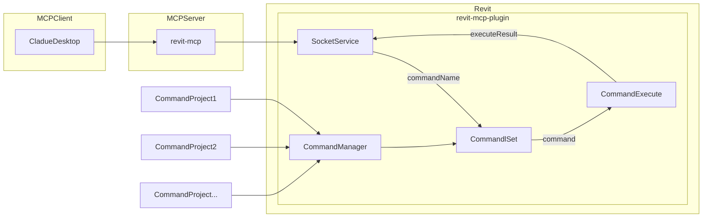
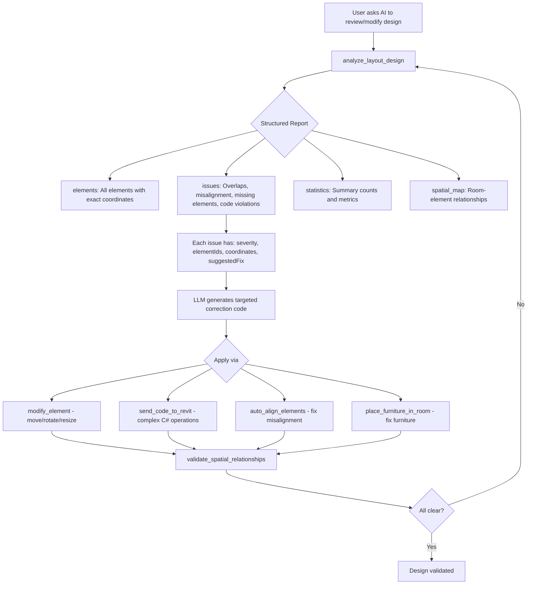
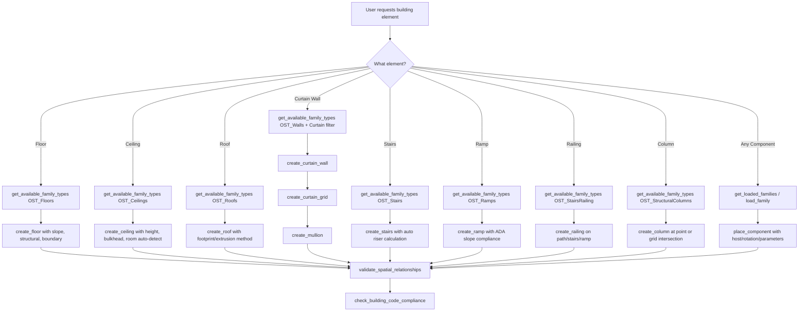

[](https://mseep.ai/app/revit-mcp-revit-mcp)

# Revit MCP Enhanced

An advanced Model Context Protocol (MCP) server for comprehensive Revit automation and drafting through natural language. Enhanced with 79+ powerful tools for BIM automation, AI-driven layout design, full drafting automation (floors, ceilings, roofs, curtain walls, stairs, ramps, railings, columns), family/component management, furniture placement, building code compliance, and intelligent design analysis.

## Description

revit-mcp allows you to interact with Revit using the MCP protocol through MCP-supported clients (such as Claude Desktop, Cline, and other AI assistants).

This project is the **MCP server side** (providing Tools to AI). You need to use [revit-mcp-plugin](https://github.com/revit-mcp/revit-mcp-plugin) (the Revit plugin that drives Revit API) in conjunction.

## Key Features

- **AI Design Analysis & Validation**: Deep model scanning that returns structured issue reports with exact coordinates, eliminating LLM hallucination and enabling precise correction code generation
- **Intelligent Furniture Automation**: Room-aware furniture placement, auto-furnishing by room type, furniture catalog browsing, and AI-driven layout optimization
- **Advanced Drafting Tools**: Auto-dimensioning (9 modes), drafting views, legend creation, annotation symbols with auto-numbering
- **Building Code Compliance**: Automated checks for egress, ADA/accessibility, fire safety, and spatial requirements (IBC, NBC India, Eurocode)
- **Layout Optimization**: AI-driven room layout optimization with 8 strategies (space efficiency, circulation, ergonomics, natural light, etc.)
- **Auto-Alignment**: Detect and correct misaligned walls, columns, doors, and furniture with configurable tolerance
- **Mirror & Copy Layouts**: Replicate furniture layouts between rooms, copy floor plans across levels
- **Comprehensive Data Retrieval**: Get detailed spatial/geometric data from Revit projects with intelligent filtering
- **Drafting Automation**: Dedicated tools for floors (sloped, structural), ceilings (grid pattern, bulkhead), roofs (footprint, extrusion), curtain walls, curtain grids, mullions, stairs, ramps, railings, columns, and openings
- **Family & Component Management**: Load families from library, browse loaded families catalog by category, and place component instances with host element support — enabling LLM-assisted component selection
- **Advanced Element Creation**: Create walls, floors, ceilings, roofs, rooms, columns, and families with natural language
- **Complete Element Modification**: Move, rotate, resize, change type, flip, mirror, pin/unpin, and set parameters
- **View & Sheet Management**: Automate view creation, duplication, and sheet organization
- **Annotation Automation**: Batch tag elements, create dimensions, add text notes, and detail lines
- **Room & Space Planning**: Create and manage rooms with automatic area calculations
- **Grid & Reference Systems**: Create grids, reference planes, and level management
- **Visual Controls**: Color-code elements, set transparency, isolate, hide, and highlight
- **Spatial Validation**: Check clearances, overlaps, adjacencies, and accessibility compliance
- **AI-Generated Code Execution**: Send custom code to Revit for complex operations

## Requirements

- nodejs 18+

> Complete installation environment still needs to consider the needs of revit-mcp-plugin, please refer to [revit-mcp-plugin](https://github.com/revit-mcp/revit-mcp-plugin)

## ⚡ Quick Setup (5 minutes)

### Automated Setup (Recommended)

**Windows:**
```bash
./quick-setup-secure.bat
```

**Linux/Mac:**
```bash
chmod +x quick-setup-secure.sh
./quick-setup-secure.sh
```

> This auto-generates your API key, creates certificates, and configures everything!

### What Gets Generated

After running setup, you'll have:
- ✅ **Random 64-char API Key** - Saved in `.env` file automatically
- ✅ **SSL Certificates** - For secure HTTPS connection
- ✅ **Configuration** - `.env` file with all settings

### Configure Claude Desktop

Edit your Claude config (`%APPDATA%\Claude\claude_desktop_config.json`):

```json
{
  "mcpServers": {
    "revit-mcp": {
      "url": "https://localhost:3000",
      "env": {
        "Authorization": "Bearer YOUR_API_KEY_HERE"
      }
    }
  }
}
```

Get your API key from the `.env` file created by setup script.

### Start Server

```bash
# Option 1: Direct
node server-secure.js

# Option 2: PM2 (Recommended)
npm install -g pm2
pm2 start ecosystem-secure.config.js
pm2 logs revit-mcp-secure
```

### Verify Connection

```bash
# Test health (no auth needed)
curl -k https://localhost:3000/health

# Test with API key
curl -k https://localhost:3000/status -H "X-API-Key: YOUR_KEY_FROM_.env"
```

---

## 🔐 Security Features

✅ **API Key Authentication** - All requests require valid API key  
✅ **HTTPS/TLS** - Encrypted communication  
✅ **IP Whitelist** - Optional, restrict by network  
✅ **Rate Limiting** - 100 requests/minute (configurable)  
✅ **Default Localhost** - Zero public exposure by default  

See `START_HERE.md` for more options.

## Framework



## Supported Tools (79+)

### 🧠 AI Design Analysis & Validation *(NEW)*

> These tools eliminate LLM hallucination by providing ground-truth model data. Always run `analyze_layout_design` before making design decisions.

| Name | Description |
| --- | --- |
| analyze_layout_design | **CRITICAL** - Deep comprehensive scan of the entire model. Returns structured issues (overlaps, misalignment, missing boundaries, code violations) with exact coordinates, element IDs, severity levels, and suggested fixes. The LLM uses the returned issue list to generate targeted correction code. Scans: structural elements, spatial relationships, furniture placement, annotations, and code compliance. |
| get_element_spatial_data | Retrieve precise spatial/geometric data for elements - bounding boxes, exact XYZ coordinates, dimensions, rotation, connected elements, room containment, facing direction, and host element info. Essential for accurate AI spatial reasoning. |
| validate_spatial_relationships | Check clearances (door swing zones, corridor widths, furniture spacing), detect overlaps, verify room adjacencies, and validate ADA/accessibility compliance with configurable thresholds. |
| check_building_code_compliance | Full building code compliance checking against IBC 2021, IBC 2018, NBC India, Eurocode, or BS UK. Checks egress (exit widths, travel distance), accessibility (ADA clearances, wheelchair turning), fire safety (rated walls, exit separation), and spatial minimums. Returns violations with code references and recommendations. |
| auto_align_elements | Detect and auto-correct misaligned walls, columns, doors, windows, furniture, grids, and annotations. Snaps elements to grid, makes near-parallel walls truly parallel, centers doors in walls. Configurable tolerance (default 10mm) with preview-before-apply mode. |

### 🪑 Furniture & Layout Automation *(NEW)*

| Name | Description |
| --- | --- |
| get_furniture_catalog | Browse all loaded furniture families and types with dimensions, categories, and type IDs. Searches across OST_Furniture, OST_FurnitureSystems, OST_SpecialityEquipment, OST_Casework, and OST_GenericModel. Filter by name, functional type (seating, tables, desks, storage, beds, sofas), and size range. |
| place_furniture_in_room | Room-aware intelligent furniture placement. Supports wall-relative positioning (against north/south/east/west wall), corner placement, center placement, and absolute coordinates. Auto-calculates rotation based on facing direction (wall, center, door, window). Validates room boundary containment and minimum clearances. |
| auto_furnish_room | Automatically furnish a room based on type and design standards. Supports: single/shared office, conference room, living room, bedroom, master bedroom, kitchen, dining room, bathroom, reception, lobby, classroom, library, and custom. Analyzes room geometry, door/window positions, and available area to generate optimal furniture layout with proper circulation paths. |
| optimize_room_layout | AI-driven layout optimization with 8 strategies: space efficiency, circulation, ergonomics, natural light, collaboration, privacy, symmetry, and balanced. Reads current room geometry and furniture, generates optimized positions, and optionally applies changes. Reports before/after metrics (utilization %, circulation score). |
| mirror_copy_layout | Mirror or copy layout patterns between rooms, levels, or regions. Mirror room furniture across an axis, copy furniture layout from one room to another, replicate entire floor layouts across levels, array-copy element groups. Intelligently adapts placement when destination has different dimensions. |

### 📐 Annotation & Drafting Tools *(EXPANDED)*

| Name | Description |
| --- | --- |
| create_dimension | Create linear, angular, and radial dimensions |
| batch_dimension_elements | **NEW** - Intelligent auto-dimensioning with 9 modes: wall lengths, wall-to-wall distances, door positions, window positions, grid spacing, room dimensions, element spacing, overall building dimensions, and custom reference pairs. Creates properly placed, non-overlapping dimension chains with automatic offset. |
| create_tag | Tag elements (doors, windows, rooms, etc.) |
| batch_tag_elements | Auto-tag multiple elements efficiently |
| create_text_note | Create text annotations in views |
| create_callout | Create detailed callout views with reference bubbles |
| create_elevation_marker | Create elevation markers generating multiple views |
| create_keynote | Add specification keynotes to elements |
| create_section_marker | Create building section views with markers |
| create_detail_lines | Create 2D detail lines for drafting |
| create_drafting_view | **NEW** - Create 2D drafting views independent of the 3D model for standard construction details, typical sections, notes, and reference drawings. Configurable scale, detail level, and discipline. Can auto-place on sheets. |
| create_legend_view | **NEW** - Create legend views for documentation. Auto-populates with project content. Types: symbol legend, material legend, color legend, door/window schedule legend, furniture legend, general notes. Can be placed on multiple sheets. |
| create_annotation_symbol | **NEW** - Place annotation/drafting symbols (north arrows, section marks, detail callout heads, revision markers, graphic scales, break lines, matchlines). Supports batch placement with auto-numbering and sequencing. |
| tag_all_walls | Tag all walls in the current view |

### 📊 Data Retrieval & Querying

| Name | Description |
| --- | --- |
| get_current_view_info | Get current active view information |
| get_current_view_elements | Get elements from the current view with category filtering |
| get_available_family_types | Get available family types in the current project. Filter by category (OST_Walls, OST_Doors, OST_Floors, OST_Roofs, OST_Stairs, OST_Ramps, OST_CurtainWallMullions, etc.) and family name. |
| get_selected_elements | Get currently selected elements with properties |
| ai_element_filter | Advanced intelligent element filtering with spatial bounding box queries, category filters, type filters, and visibility options |
| get_views_list | List all views with filtering options |
| get_sheets_list | List all sheets in the project |
| get_grids_list | List all grids with geometry data |
| get_levels_list | List all levels with elevations |
| get_rooms_list | List all rooms with area, perimeter, volume, level, and department. Filter by level, phase, area range, and name. |

### 🏗️ Element Creation (Generic)

| Name | Description |
| --- | --- |
| create_point_based_element | Create point-based elements (doors, windows, furniture) with position, dimensions, and rotation |
| create_line_based_element | Create line-based elements (walls, beams, pipes) with start/end points and dimensions |
| create_surface_based_element | Create surface-based elements (floors, ceilings, roofs) with boundary definitions |

### 🏢 Drafting Automation — Floors, Ceilings & Roofs *(NEW)*

> Dedicated tools with full parameter support for each element type. These go far beyond generic surface-based creation by exposing slope, structural properties, grid patterns, overhangs, and more.

| Name | Description |
| --- | --- |
| create_floor | **NEW** — Create floor elements with advanced options: structural vs. architectural floors, sloped floors (slope arrow with tail/head points and angle), span direction for structural analysis, inner loops for floor openings, and level/offset control. Supports batch creation. Use `get_available_family_types` with `['OST_Floors']` to discover floor types. |
| create_ceiling | **NEW** — Create ceiling elements with support for automatic ceilings (fills room boundary) and sketch-based ceilings with custom boundary. Configurable height offset, slope arrows for sloped ceilings, inner loops for openings (light fixtures, HVAC), and bulkhead (dropped ceiling) configuration with custom drop height and boundary. |
| create_roof | **NEW** — Create roofs via three methods: **Footprint** (boundary with per-edge slope angles, gable ends, and overhang), **Extrusion** (profile cross-section extruded along a reference plane), and **FaceBase** (on mass faces). Supports inner loops for skylights/shafts, cutoff levels for multi-story roofs, and default slope/overhang settings. |
| create_opening | **NEW** — Create openings in walls, floors, roofs, and ceilings. Supports rectangular openings (center + width/height + sill height), circular openings (center + radius for ducts/pipes), custom-shaped openings (boundary loop), and vertical shaft openings spanning multiple levels with symbolic plan representation. |

### 🔲 Curtain Wall System *(NEW)*

> Complete curtain wall workflow: create the wall, configure the grid, then place mullions. Each tool provides granular control over the curtain wall components.

| Name | Description |
| --- | --- |
| create_curtain_wall | **NEW** — Create curtain walls with configurable grid layout (vertical/horizontal spacing, pattern rules: FixedDistance, FixedNumber, MaximumSpacing, MinimumSpacing), default panel type, default mullion type, multi-level support (base level to top level), and justification options. Integrates with `get_available_family_types` using `'OST_Walls'` with `'Curtain'` filter. |
| create_curtain_grid | **NEW** — Add, remove, or modify curtain grid lines on existing curtain walls/systems/roofs. Supports U (horizontal) and V (vertical) direction grid lines at precise positions, one-segment vs. full-span grid lines, excluded segments for partial grids, and grid line locking to prevent accidental modification. |
| create_mullion | **NEW** — Place mullions on curtain wall grid lines with full control: place on specific grid segments, replace mullion types, place on all grid lines at once, configure border mullions separately, and set corner mullion conditions (Miter, Border1OverlapsBorder2, Border2OverlapsBorder1). Use `get_available_family_types` with `'OST_CurtainWallMullions'` to browse mullion types. |

### 🪜 Stairs, Ramps & Railings *(NEW)*

> Full vertical circulation tools with building code awareness. Stairs auto-calculate riser count from floor-to-floor height. Ramps support ADA slope compliance. Railings can be standalone or hosted on stairs/ramps.

| Name | Description |
| --- | --- |
| create_stairs | **NEW** — Create stairs connecting two levels with shapes: Straight, L-Shape, U-Shape, Spiral, and ThreeRun. Auto-calculates riser count and tread depth from floor-to-floor height. Supports custom runs with curved segments, custom landings, riser/tread dimensions, automatic railing creation, and structural support types (Stringer, Carriage). |
| create_ramp | **NEW** — Create accessible ramps with ADA/accessibility compliance support. Configurable slope ratio (default 1:12), width (minimum 915mm ADA), multi-run with automatic landings, curved runs, shapes (Straight, Spiral, LShape, UShape), automatic railings, and multi-level connections. |
| create_railing | **NEW** — Create railings along paths, on stairs, on ramps, or along floor/slab edges. Supports curved path segments (arcs with center point), horizontal offset, side selection (Left/Right/Both), flip direction, and host element attachment for stairs and ramps. Use `get_available_family_types` with `'OST_StairsRailing'` for railing types. |

### 🏛️ Columns *(NEW)*

| Name | Description |
| --- | --- |
| create_column | **NEW** — Create architectural and structural columns with level constraints (base to top level), rotation, slanted column support (lean from base to top point), grid intersection snapping (place at intersection of two grid lines), and unconnected height for standalone columns. Supports both `'OST_Columns'` (architectural) and `'OST_StructuralColumns'` (structural) categories. |

### 📦 Family & Component Management *(NEW)*

> These tools enable LLM-assisted component selection: first discover what's available (loaded or in library), then place the right component. Essential for AI-driven drafting workflows.

| Name | Description |
| --- | --- |
| load_family | **NEW** — Load Revit family files (.rfa) from library into the project. Actions: `list` (browse families in directory), `load` (load specific .rfa file), `search` (find families by name across library paths), `listCategories` (list all available family categories). Supports default Revit library, custom paths, subfolder recursion, and overwrite control. |
| get_loaded_families | **NEW** — Get comprehensive catalog of all families currently loaded in the project, organized by category. Returns family names, type names, type IDs, and optionally detailed parameters and type preview images. Supports filtering by 25+ categories (Doors, Windows, Furniture, Columns, MEP, Site, etc.) and family name. Essential first step for LLM to choose the right component. |
| place_component | **NEW** — High-level component placement tool for any loaded family type. Supports all categories: doors (on walls), windows (on walls), furniture, columns, structural framing, MEP, fixtures, site elements, etc. Features: rotation, level assignment, host element/face selection, vertical offset, flip/mirror, structural type designation, and instance parameter overrides after placement. |

### 👁️ View Management

| Name | Description |
| --- | --- |
| create_view | Create floor plans, sections, elevations, and 3D views |
| duplicate_view | Duplicate views with detailing options |
| set_view_properties | Modify view scale, detail level, and templates |
| set_view_range | Configure view range (top, cut plane, bottom, underlay) |
| create_scope_box | Create scope boxes for coordinated view cropping |

### 📄 Sheet & Viewport Management

| Name | Description |
| --- | --- |
| create_sheet | Create sheets with titleblocks |
| place_viewport | Place views on sheets as viewports |

### 📏 Grid & Reference Systems

| Name | Description |
| --- | --- |
| create_grid | Create linear and arc grid lines |
| create_reference_plane | Create reference planes for alignment |

### 🏠 Room & Space Management

| Name | Description |
| --- | --- |
| create_room | Create rooms with automatic area calculation |
| create_room_separation_line | Define room boundaries with separation lines |
| update_room_properties | Update room names, numbers, department, finishes |
| store_room_data | Store room data in local database |

### 📊 Schedules & Analysis

| Name | Description |
| --- | --- |
| create_schedule | Create room, door, window, and material schedules |
| apply_view_filter | Apply parametric filters with graphic overrides |
| create_color_scheme | Create color-coded plans by parameter values |

### 🎨 Detail Components

| Name | Description |
| --- | --- |
| create_filled_region | Create hatched/patterned regions for details |
| create_detail_component | Place 2D detail symbols (bolts, welds, etc.) |
| create_masking_region | Create opaque masks to hide drawing areas |

### 📝 Revision & Documentation

| Name | Description |
| --- | --- |
| create_revision_cloud | Create revision clouds to mark design changes |
| manage_revisions | Create and manage project revision tracking |

### ✏️ Element Modification & Operations *(EXPANDED)*

| Name | Description |
| --- | --- |
| modify_element | **FIXED** - Comprehensive element modification: move (relative/absolute), rotate, resize, change type, set parameters, flip (hand/facing/workplane), mirror, pin/unpin. Supports batch modifications with individual actions per element. |
| operate_element | Select, color, set transparency, hide, temp-hide, isolate, unhide, reset-isolate, highlight, and delete elements |
| delete_element | Delete elements from the project |
| color_elements | Color elements based on parameter values |

### 🔧 Advanced Tools

| Name | Description |
| --- | --- |
| send_code_to_revit | Send C# code to Revit for execution with access to Document and parameters |
| search_modules | Search for available modules |
| use_module | Use module for extended functionality |

### 💾 Data Persistence

| Name | Description |
| --- | --- |
| store_project_data | Store project metadata in local database |
| query_stored_data | Query stored project and room information |

---

## AI Design Analysis Workflow

The `analyze_layout_design` tool is the cornerstone of accurate AI-driven design review. Here's how it eliminates hallucination and enables precise corrections:



### Why This Prevents Hallucination

| Problem | Before | After |
| --- | --- | --- |
| Element positions | LLM guesses coordinates | `get_element_spatial_data` returns exact XYZ from Revit |
| Design issues | LLM assumes what's wrong | `analyze_layout_design` scans and reports actual issues |
| Code compliance | LLM makes up requirements | `check_building_code_compliance` checks against real standards |
| Clearances | LLM estimates distances | `validate_spatial_relationships` measures actual gaps |
| Furniture fit | LLM guesses room size | `place_furniture_in_room` validates against real boundaries |

### Recommended Workflow for AI Assistants

1. **Always start with analysis**: Call `analyze_layout_design` with `analysisScope: "full"` before making any suggestions
2. **Get spatial data**: Use `get_element_spatial_data` for precise coordinates of elements you need to modify
3. **Discover components**: Use `get_loaded_families` or `load_family` to find available family types before placement
4. **Make changes**: Use dedicated tools (`create_floor`, `create_stairs`, `create_curtain_wall`, `place_component`, etc.) or `modify_element`, `place_furniture_in_room`, `send_code_to_revit`
5. **Validate**: Run `validate_spatial_relationships` after changes to confirm correctness
6. **Check compliance**: Run `check_building_code_compliance` for final verification

### Drafting Automation Workflow (NEW)


